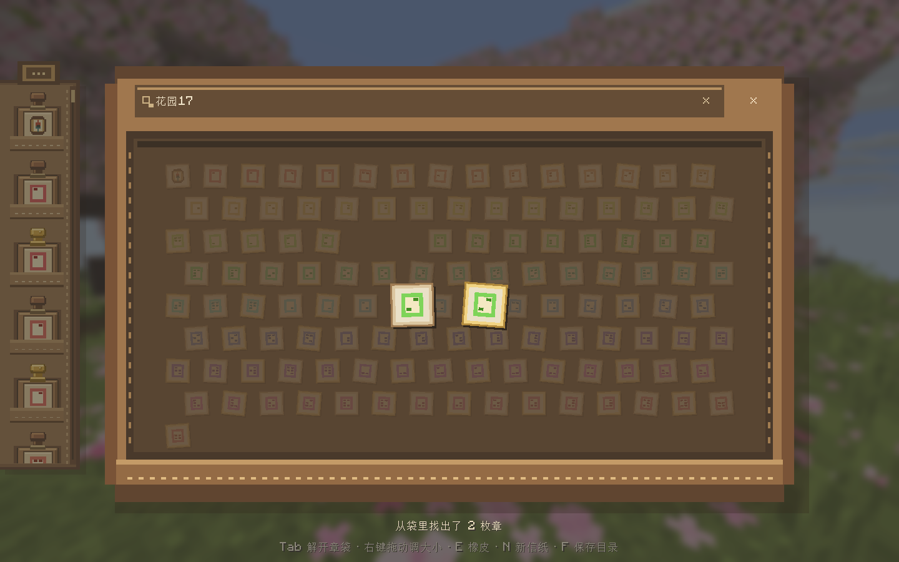

# Postmark · 旅途来信

Minecraft 客户端明信片模组：从章袋取出印章，盖下旅途的回忆，装进信封、手写签名，保存到本地。

**Minecraft 26.1.2 · NeoForge 26.1.2.75 · Java 25 · MIT**

[下载安装包](https://github.com/zhongbai2333/Postmark/releases) · [操作说明](docs/USAGE.md) · [开发与贡献](CONTRIBUTING.md) · [更新记录](CHANGELOG.md)

## 可以做什么

- 素色像素信纸、浅色 TeaCon 底纹和模糊世界背景，也可以拖入照片，选择居中裁切或完整保留原图比例。
- 拖动实体印章落纸；同章可重复盖印，落下后固定，只能擦除。
- 持章时右键拖动调大小、滚轮旋转；停稳 500 ms 后显示半透明落点预览，继续移动也保持。
- 展开皮革章袋，在蜂窝章堆中悬停放大；输入展区名，匹配的章从袋里浮出来。
- 翻开明信片收集册，左右各四张缩略图，翻页查看全部卡片，点击打开或确认删除。
- 集章吊牌显示收藏数量；翻面查看普通、大师和展馆统计，每十枚解锁可放进明信片的纪念票。
- 图形控件支持鼠标操作，详细说明仅在底部悬停提示中出现。
- 与 [SignMeUp / ExhibitionPortal](https://github.com/teaconmc/SignMeUp) 联动，保存原生章面；大师章使用金色握柄。
- 装信封、翻面、鼠标签名，导出明信片和签名信封两张 PNG；原图模式下信纸、信封及导出一起适应图片比例。成功后打开本地文件夹，自动换新信纸，旧卡仍可翻回。



*图中彩色章为大量印章测试用素材；实际章面由服务器和资源包提供。*

## 安装

1. 准备 Minecraft **26.1.2**、NeoForge **26.1.2.75** 和 **Java 25**。当前依赖范围见模组元数据。
2. 从 [Releases](https://github.com/zhongbai2333/Postmark/releases) 下载 `postmark-26.1.2-0.1.0-alpha.13.jar`，放入客户端实例的 `mods` 文件夹。不要安装 `-sources.jar`。
3. 进入世界，按 **P** 打开明信片；按键可在游戏控制设置中修改。

Postmark 仅需客户端安装。没有 SMU 也能使用，提供一枚“启程”预设章；更多章来自 SMU。联动已验证 ExhibitionPortal **1.1.12**，服务器需正常运行其原有 SMU 环境。

## 快速操作

| 操作 | 效果 |
| --- | --- |
| 从左侧拖章到纸上松开 / 点击拿章，再点纸面 | 盖印并自动归位 |
| 持章右键拖动 / 滚轮 | 调整大小 / 旋转 |
| 腰包顶部搭扣 / Tab | 展开或收起蜂窝章袋 |
| 袋口输入展区名，可加“普通”或“大师” | 找出实际已收藏的匹配章 |
| E / 点击橡皮 | 拿起橡皮，擦掉最上层印迹 |
| 纸张左右箭头 / [ / ] | 翻页 |
| 纸上方的加号纸张 / 素纸控件 | 新信纸 / 恢复素纸（也可 N / B） |
| 拖入 PNG、JPG，点击效果预览 | 居中裁切为 3:2 / 完整保留原图比例 |
| 加号右侧的大册子图标 | 每屏八张，翻页、打开或删除明信片 |
| 左下集章吊牌 | 翻面查看统计；点击已解锁的纪念票拿取 |
| 右下信封角 | 装入信封并翻面签名 |
| 签名左侧回转箭头 / 橡皮 | 撤回上一笔 / 清空签名（也可 Ctrl+Z / Delete） |
| 信封右下封蜡 | 导出并寄出，可留白 |
| 右上 × / 袋口 × / 信封左下纸角 | 关闭、收袋或返回（也可 Esc） |
| 信纸右侧文件夹 | 打开收藏册导出目录（也可 F） |

详细交互、草稿保存及目录说明见 [操作说明](docs/USAGE.md)。

## SMU 联动

点击原盖章台时，服务端照常授章；Postmark 打开明信片，并将 SMU 地图印迹放在交互时的玩家坐标，地图上的章继续显示。地图章目标边长约为玩家标记可见尺寸的 **1.15 倍**。

章面按 SMU 原规则读取物品 GUI 模型或 PNG，保留像素、颜色和透明度。展区名称来自客户端同步的 SMU 元数据；普通 `visitor` 与大师 `expert` 分别识别。章按“展区 UUID + 章 ID”区分，共用图案不会合并。袋里仅展示已收藏的章，没有某种章时不生成占位。

更多版本依据和兼容边界见 [SMU 联动说明](docs/COMPATIBILITY.md)。

## 本地保存

草稿位于游戏实例的 `postmark/<上下文哈希>/album.json`，按玩家与服务器/单人世界隔离；图片在同目录的 `assets/`，导出位于 `exports/`。每次导出一个独立文件夹：

```text
front.png       明信片正面
envelope.png    带签名的信封背面
```

标准卡为 1800 × 1200；原图模式长边为 1800，另一边按比例取整，正面和签名信封尺寸一致。

两张图片写入成功后才播放寄出完成动画、打开文件夹并创建新卡。寄出不删除旧草稿，也不向网络发送明信片或签名。SMU 地图章位置会按原联动协议同步给服务器。

## 开发与验证

```sh
./gradlew build
```

Windows 使用 `./gradlew.bat build`，需要 JDK 25。当前 **28 项单元测试**通过，另有真实 Minecraft 工作台和 SMU 集成服务器测试。命令、夹具及验证边界见 [CONTRIBUTING.md](CONTRIBUTING.md) 和 [验证记录](docs/VALIDATION.md)。

当前为 alpha：界面主要为中文；拼音搜索、纸张模板和自由选择裁切区域尚未实现（目前为居中裁切）。特殊物品渲染器、远程活动服专用资源包仍需实际验证。

## 许可证

Postmark 源代码及原创素材采用 [MIT License](LICENSE)。Gradle wrapper、TeaCon 标识及游戏/服务器素材保留各自的权利与许可，详见 [第三方说明](THIRD_PARTY_NOTICES.md)。
